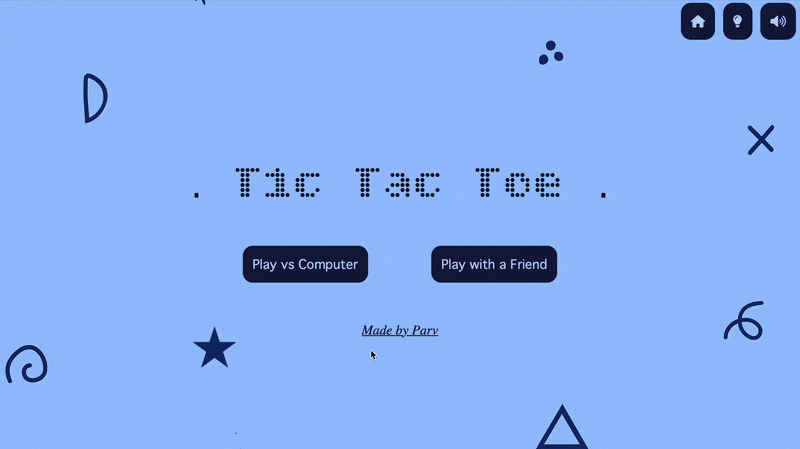
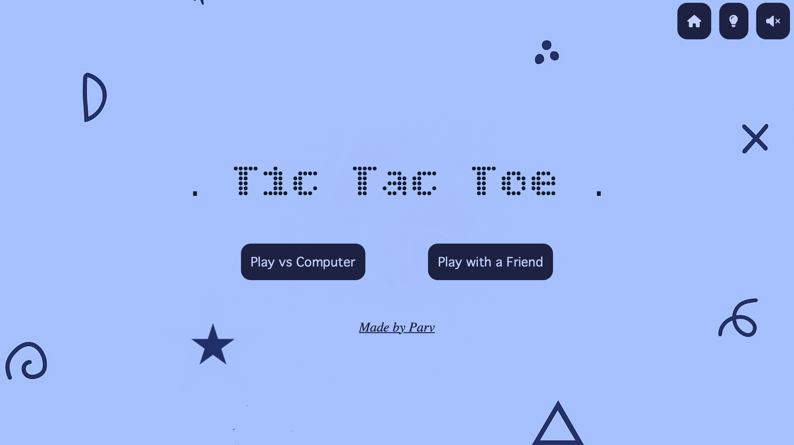
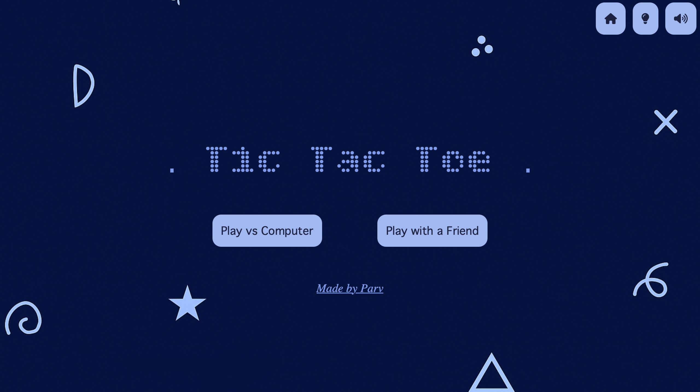
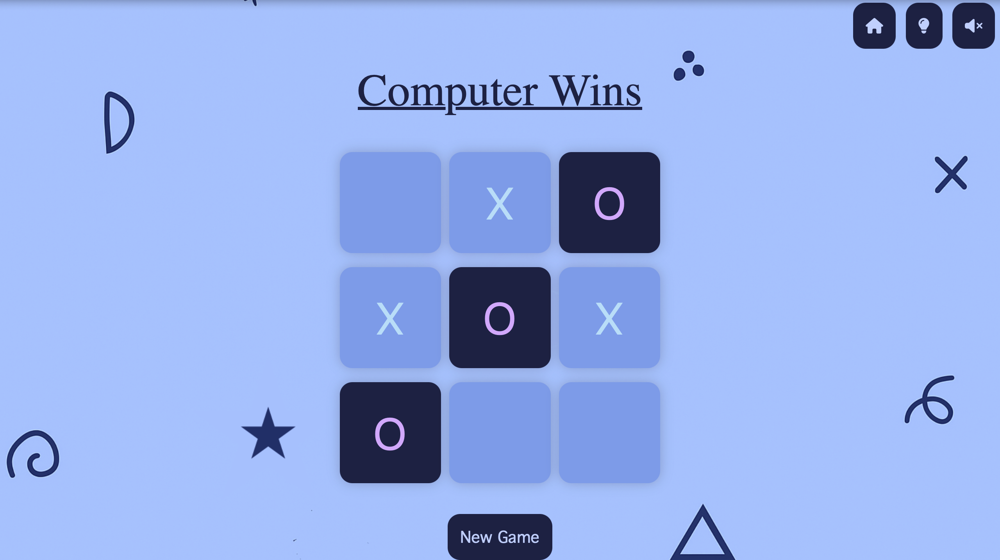
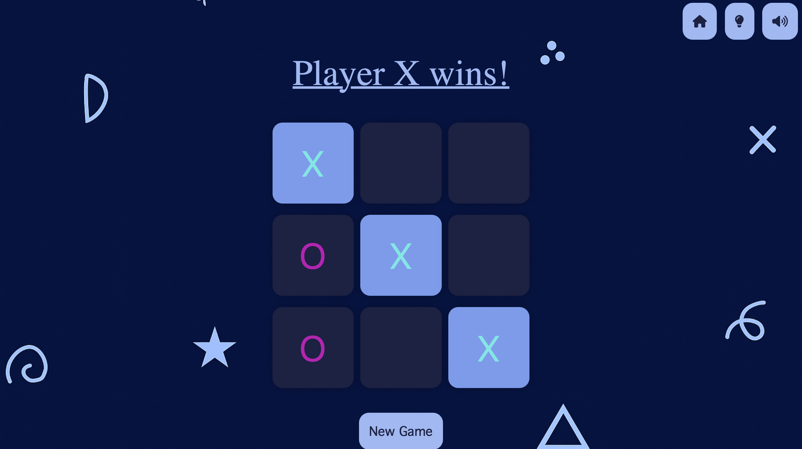

# ✨ Tic Tac Toe

A clean, responsive Tic Tac Toe game built with HTML, CSS, and JavaScript.

<p align="center">
  
</p>

---

## 🎮 Features

- 🔹 **Single Player** (vs Computer)
- 🔹 **Two Player** (Multiplayer)
- 🔹 **Light & Dark Themes**
- 🔹 **Responsive Design**
- 🔹 **Hover Animations**
- 🔹 **Background Music Toggle**

---

## 🔗 Live Demo

🚀 [Play tic-tac-toe](https://parvninama.github.io/tic-tac-toe/)

---

## 🛠️ Tech Stack

- **HTML5** - Markup structure
- **CSS3** - Styling and responsive design
- **JavaScript (Vanilla)** - Game logic, interactivity
- [Font Awesome](https://fontawesome.com/)
- [Google Fonts – Bitcount Grid Double](https://fonts.google.com/specimen/Bitcount+Grid+Double)

---

## 📁 Files & Structure

```
tic-tac-toe/
├── index.html
├── styles.css
├── app.js
├── images/
│   ├── light-mode.png
│   ├── dark-mode.png
│   ├── light-mode-mobile.png
│   ├── dark-mode-mobile.png
│   └── tic-tac-toe.png
├── screenshots/
│   ├── demo.gif
│   ├── home-light.png
│   ├── home-dark.png
│   ├── gameplay-light.png
│   └── gameplay-dark.png
├── README.md
└── LICENSE (optional)
```

---

## 🧠 AI Logic

In single-player mode, the computer:
1. Tries to win if possible
2. Blocks player’s win
3. Picks the center if available
4. Chooses a random corner
5. Picks any remaining spot

---

## 📸 Screenshots

### 🏠 Home Screen

**Light Mode**  


**Dark Mode**  


---

### 🎮 Gameplay

**Light Mode (Single Player)**  


**Dark Mode (Multiplayer)**  


---

## 📋 Credits

- **Favicon**  
  Icon by [Freepik](https://www.flaticon.com/authors/freepik) from [Flaticon](https://www.flaticon.com/)

- **Background Music**  
  *Driftveil City Theme* from **Pokémon Black and White**  
  © Nintendo / Game Freak  
  Source: [VGMusic Treasure Chest](https://eta.vgmtreasurechest.com/soundtracks/pokemon-black-and-white-super-music-collection/hhrvqtky/2-02.%20Driftveil%20City.mp3)

> *Used for non-commercial, educational/demo purposes only.*

## 📜 License

This project is licensed under the **MIT License** — feel free to use, modify, and share!

---

## 🤝 Connect

Feel free to check out more of my work on  
👉 [Parv Ninama](https://github.com/parvninama)